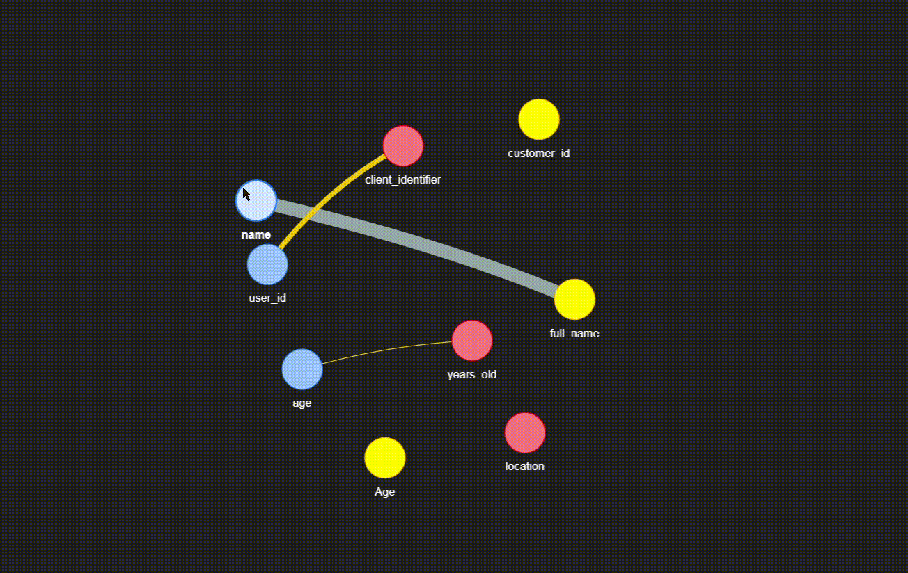

# Find My Joint 


> [!NOTE]
> A Python utility to analyze and compare columns across multiple pandas DataFrames, suggesting potential join keys and visualizing the relationships.

> 💜 **Package Documentation**: https://rudra-g-23.github.io/Find-My-Joint/


When working with multiple disparate datasets, finding common columns to join them on is a tedious manual task. findmyjoint automates this by:

1. Profiling each DataFrame's columns (dtype, uniqueness, nulls).
2. Comparing all possible column pairs across datasets.
3. Scoring pairs based on name similarity (using rapidfuzz) and content similarity (using Jaccard index).
4. Suggesting join confidence levels.
5. Visualizing the connections as an interactive network graph (using pyvis).

## Gallery
| Apply on 30 Datasets | E-commerce | Instacart | Demo |
|:------------:|:-----------:|:-----------:|:------:|
|  |  |  |  |
| [Code](https://www.kaggle.com/code/rudraprasadbhuyan/30-datasets-apply-find-my-joint-02) | [Code](https://www.kaggle.com/code/rudraprasadbhuyan/apply-find-my-joint-on-ecommerce-dataset-03) | [Code](https://www.kaggle.com/code/rudraprasadbhuyan/how-to-use-find-my-joint-python-package-01) | [Code](https://www.kaggle.com/code/rudraprasadbhuyan/my-python-package-find-my-joint-demo) |
    
## Installation
You will be able to install this via pip once it's published:

Install from PyPI:
```bash
pip install findmyjoint
```

Install from source(development)
```bash
git clone https://github.com/Rudra-G-23/Find-My-Joint.git

cd Find-My-Joint

python -m venv .venv
# Linux / macOS
source .venv/bin/activate

# Windows (PowerShell)
.venv\Scripts\Activate.ps1

pip install -e ".[all]"
```


## Quickstart

You can get a comparison matrix or an interactive graph with a single line of code.

### 1. Create toy datasets
```bash
# Install 
pip install findmyjoint pandas -q

# Import
import pandas as pd
import findmyjoint as fmj

# Create data frames
df1 = pd.DataFrame({
    'age': [21, 25, 30, 45],
    'name': ['Alice', 'Bob', 'Charlie', 'David'],
    'user_id': ['001', '002', '003', '004']
})

df2 = pd.DataFrame({
    'Age': ['21', '25', '30', '45'],
    'full_name': ['Alice', 'Bob', 'Charlie', 'David'],
    'customer_id': [1, 2, 3, 4]
})

df3 = pd.DataFrame({
    'client_identifier': ['001', '002', '003', '004'],
    'location': ['USA', 'CAN', 'USA', 'MEX'],
    'years_old': [21, 25, 30, 45]
})

# Your joint requirement
datasets = [df1, df2, df3]
names = ['hr', 'crm', 'finance']

# 2. Get the comparison matrix
print("--- Comparison Matrix ---")
matrix = fmj.compare(datasets, names=names, name_threshold=0.6)
print(matrix.head())

# 3. Generate the interactive network graph
# This will create and automatically open 'joint_graph.html'
print("\n--- Generating Network Graph ---")
fmj.network(datasets, names=names, threshold=0.6)
print("Graph 'joint_graph.html' created.")
```

### 2. Potential join Data Frame with suggestions
```bash
| dataset_left | column_left | dataset_right | column_right      | name_sim | dtype_match | content_sim | suggestion                         | edge_weight |
| ------------ | ----------- | ------------- | ----------------- | -------- | ----------- | ----------- | ---------------------------------- | ----------- |
| hr           | name        | crm           | full_name         | 0.615385 | 1.0         | 1.0         | Review                             | 0.846154    |
| hr           | user_id     | finance       | client_identifier | 0.333333 | 1.0         | 1.0         | Rename candidate (content matches) | 0.733333    |
| hr           | age         | finance       | years_old         | 0.166667 | 1.0         | 1.0         | Rename candidate (content matches) | 0.666667    |
| hr           | name        | crm           | Age               | 0.571429 | 1.0         | 0.0         | Review                             | 0.428571    |
| hr           | age         | crm           | Age               | 1.000000 | 0.0         | 0.0         | Review                             | 0.400000    |
| hr           | user_id     | crm           | customer_id       | 0.777778 | 0.0         | 0.0         | Review                             | 0.311111    |
| hr           | user_id     | finance       | years_old         | 0.500000 | 0.0         | 0.0         | Review                             | 0.200000    |
```

### 3. Joint Visualization
